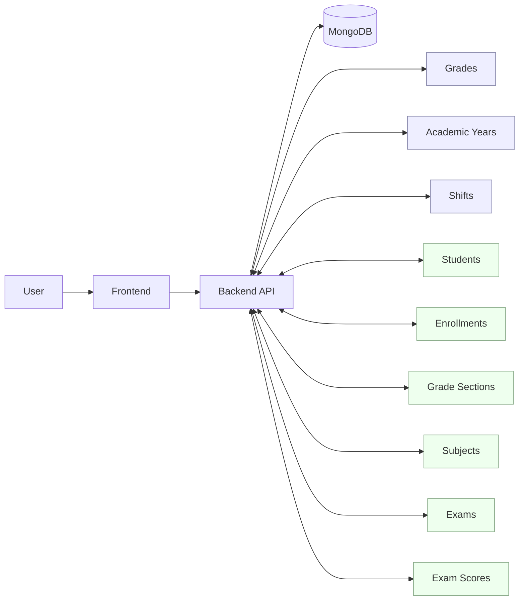
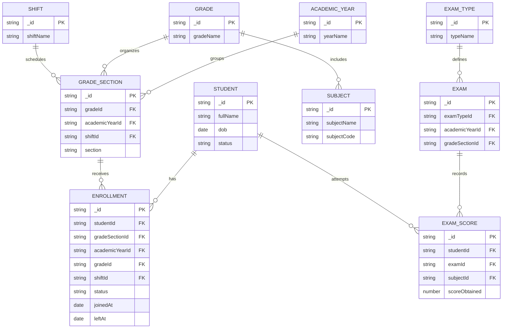
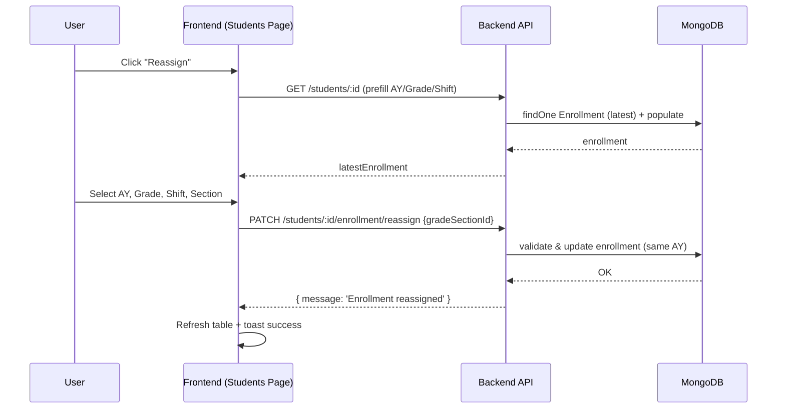
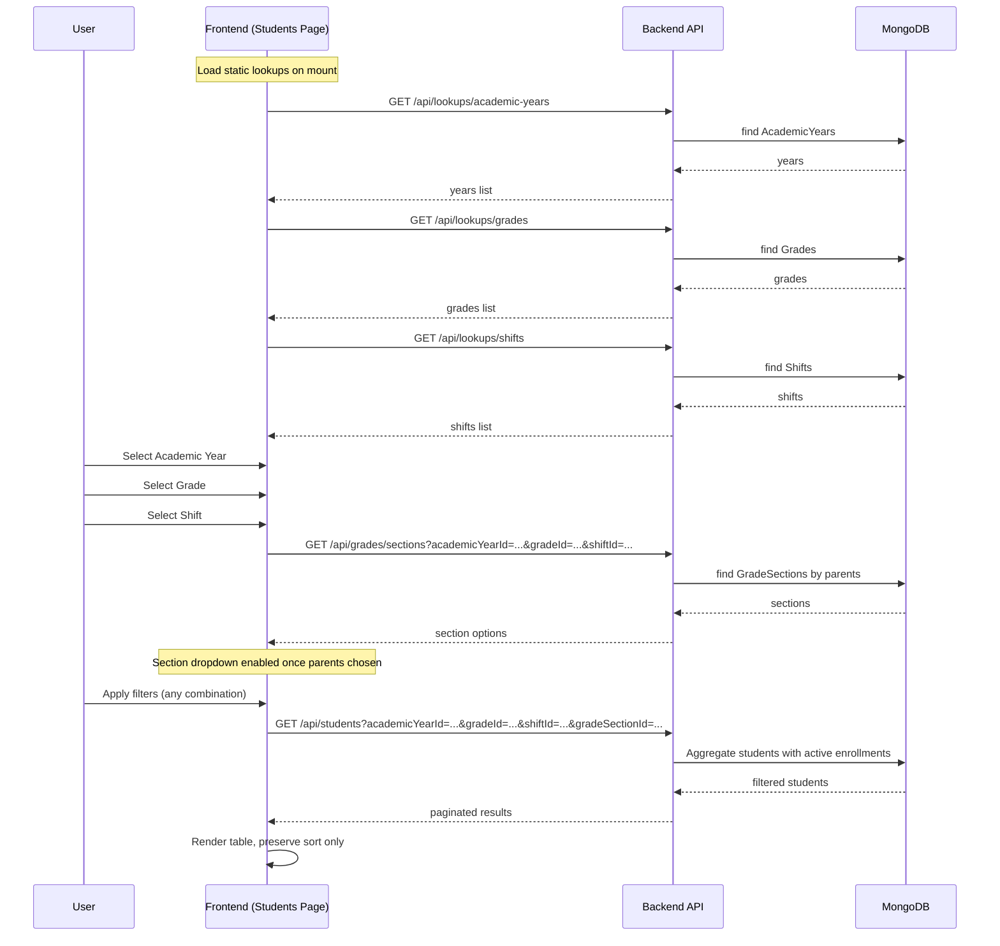
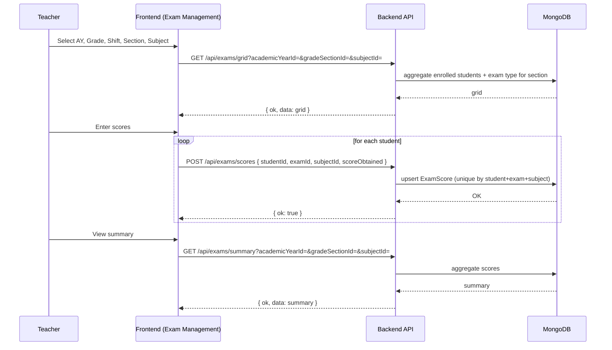
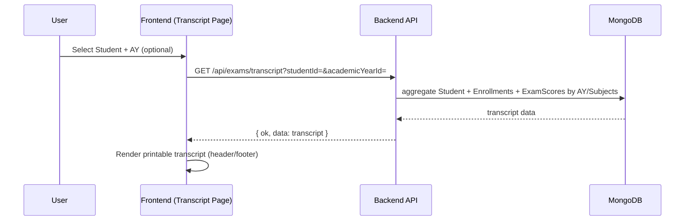

# Diagrams (Mermaid)

Fiiro: Ku fur VS Code oo leh Mermaid preview ama isticmaal markdown viewer taageera Mermaid.

## 1) Data Flow Diagram (DFD – Level 0)


## 2) ERD (Simplified)


## 3) Sequence: Reassign Enrollment


## 4) Sequence: Students Filtering


## 5) Sequence: Exam Scoring & Summary

## 6) Sequence: Transcript Generation

```
