# Diagrams (Mermaid)

Fiiro:
- Ku fur VS Code oo leh Mermaid preview, ama isticmaal Markdown viewer taageera Mermaid.
- Diagrams-kan waxaa lagu saleeyay *code-ka dhab ah* ee hadda jira (`backend/models/*` iyo routes/controllers).

## 1) System Data Flow (DFD – Level 0)

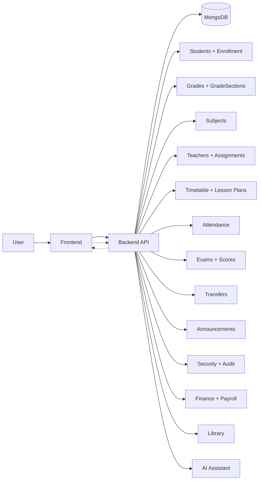

Qeexid: User = Admin / Staff / Teacher / Student.

## 2) ERD – Core Academic Models (Roster/Enrollment)

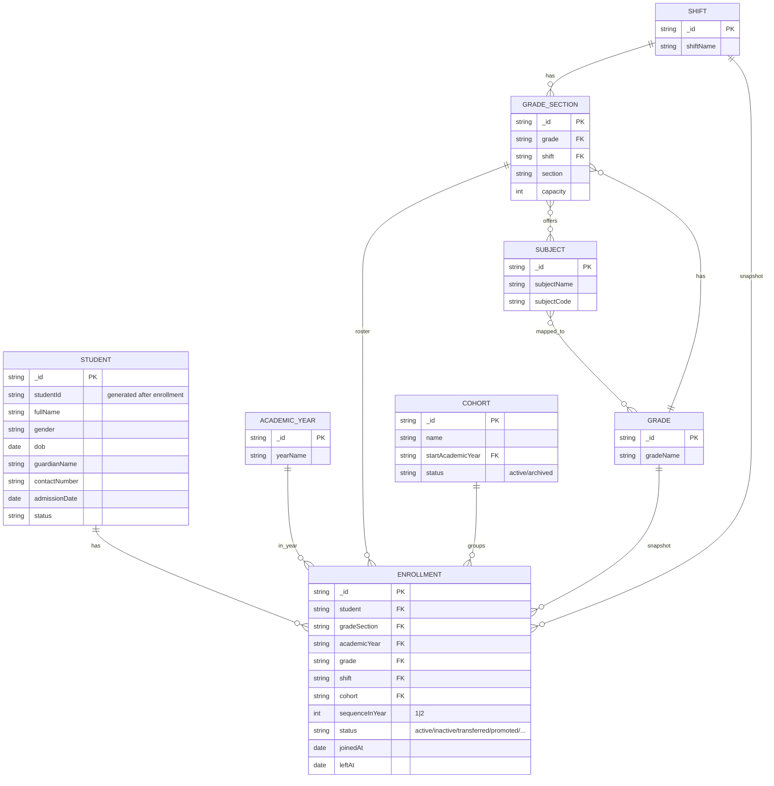

## 2b) ERD – Transfers + Counters (IDs)

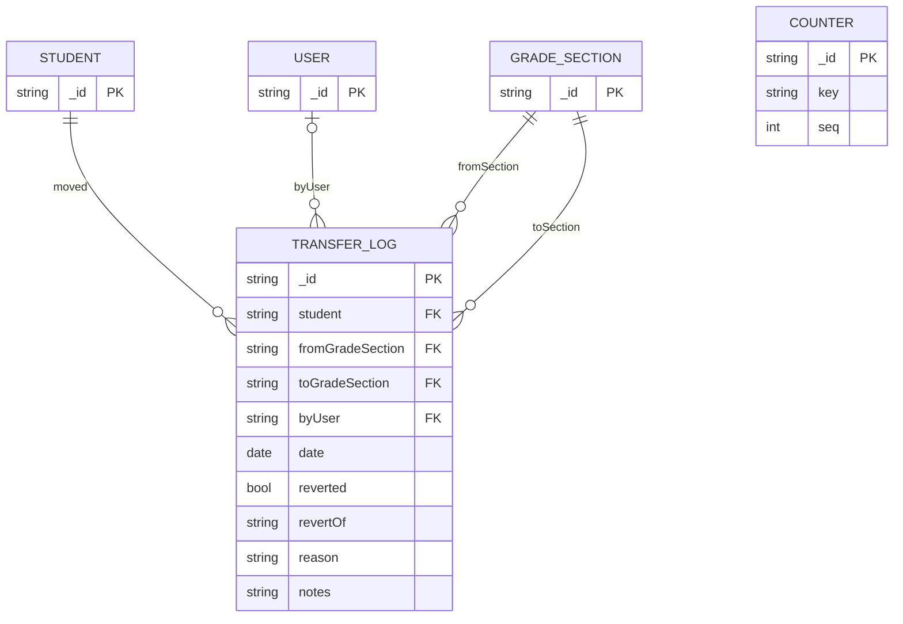

## 7b) ERD – Full System (All Models)

```mermaid
erDiagram
  %% -----------------------------
  %% Auth / Accounts / Security
  %% -----------------------------
  USER o|--|| STUDENT : studentRef
  USER o|--|| TEACHER : teacherRef

  USER ||--o{ AUDIT_LOG : emits

  %% Auth lock alerts can reference either User or Admin (or Unknown)
  USER o|--o{ AUTH_LOCK_EVENT : principal
  ADMIN o|--o{ AUTH_LOCK_EVENT : principal
  USER o|--o{ AUTH_LOCK_EVENT : resolvedBy
  ADMIN o|--o{ AUTH_LOCK_EVENT : resolvedBy

  %% Activity notifications (internal)
  USER o|--o{ ACTIVITY_NOTIFICATION : actorUserId
  USER o|--o{ ACTIVITY_NOTIFICATION : resolvedBy

  %% -----------------------------
  %% Core Academic
  %% -----------------------------
  STUDENT ||--o{ ENROLLMENT : has
  ACADEMIC_YEAR ||--o{ ENROLLMENT : inYear
  GRADE_SECTION ||--o{ ENROLLMENT : roster
  COHORT o|--o{ ENROLLMENT : cohort
  GRADE ||--o{ GRADE_SECTION : has
  SHIFT ||--o{ GRADE_SECTION : has

  %% Many-to-many (via arrays)
  GRADE_SECTION }o--o{ SUBJECT : offers
  SUBJECT }o--o{ GRADE : mapped

  TEACHER ||--o{ TEACHER_ASSIGNMENT : teaches
  GRADE_SECTION ||--o{ TEACHER_ASSIGNMENT : inSection
  SUBJECT ||--o{ TEACHER_ASSIGNMENT : forSubject

  GRADE_SECTION ||--o{ TIMETABLE : timetable
  SUBJECT o|--o{ TIMETABLE : subject
  TEACHER o|--o{ TIMETABLE : teacher

  TEACHER ||--o{ LESSON_PLAN : writes
  ACADEMIC_YEAR ||--o{ LESSON_PLAN : inYear
  GRADE_SECTION ||--o{ LESSON_PLAN : forSection
  SUBJECT ||--o{ LESSON_PLAN : forSubject

  EXAM_TYPE ||--o{ EXAM : defines
  ACADEMIC_YEAR ||--o{ EXAM : inYear
  GRADE_SECTION ||--o{ EXAM : forSection
  EXAM ||--o{ EXAM_SCORE : has
  STUDENT ||--o{ EXAM_SCORE : student
  SUBJECT ||--o{ EXAM_SCORE : subject

  GRADE_SECTION ||--o{ ATTENDANCE_RECORD : has
  STUDENT ||--o{ ATTENDANCE_RECORD : student
  TEACHER o|--o{ ATTENDANCE_RECORD : markedBy
  USER o|--o{ ATTENDANCE_RECORD : markedByUser

  GRADE_SECTION ||--o{ ATTENDANCE_AUDIT_LOG : has
  STUDENT ||--o{ ATTENDANCE_AUDIT_LOG : student
  TEACHER o|--o{ ATTENDANCE_AUDIT_LOG : markedBy

  STUDENT ||--o{ TRANSFER_LOG : moved
  USER o|--o{ TRANSFER_LOG : byUser
  GRADE_SECTION ||--o{ TRANSFER_LOG : fromSection
  GRADE_SECTION ||--o{ TRANSFER_LOG : toSection

  %% Announcements
  USER o|--o{ ANNOUNCEMENT : createdById
  GRADE_SECTION o|--o{ ANNOUNCEMENT : audience

  %% -----------------------------
  %% Library
  %% -----------------------------
  USER o|--o{ LIBRARY_RESOURCE : createdBy
  GRADE o|--o{ LIBRARY_RESOURCE : grade_scope
  SUBJECT o|--o{ LIBRARY_RESOURCE : subject_scope

  %% -----------------------------
  %% Finance
  %% -----------------------------
  FINANCE_CATEGORY ||--o{ FEE_INVOICE : items_category_embedded
  FINANCE_CATEGORY o|--o{ EXPENSE : categoryRef
  FINANCE_CATEGORY o|--o{ DONATION : project
  FINANCE_CATEGORY o|--o{ FINANCE_APPOINTMENT : amountType

  ACCOUNT o|--o{ FEE_TRANSACTION : received_to
  ACCOUNT o|--o{ EXPENSE : spent_from
  ACCOUNT o|--o{ PAYROLL : paid_from
  ACCOUNT o|--o{ DONATION : received_to

  STUDENT ||--o{ FEE : fee_ledger
  STUDENT ||--o{ STUDENT_FEE : monthly_charges
  STUDENT ||--o{ FEE_INVOICE : invoices
  STUDENT ||--o{ FEE_TRANSACTION : transactions
  STUDENT ||--o{ FINANCE_APPOINTMENT : appointments

  GRADE_SECTION o|--o{ FEE : for_section
  ACADEMIC_YEAR o|--o{ FEE : in_year

  FEE ||--o{ FEE_PAYMENT : payments_legacy
  STUDENT_FEE ||--o{ PAYMENT_LOG : payments_legacy

  FEE_INVOICE ||--o{ FEE_TRANSACTION : payments

  USER o|--o{ FEE_INVOICE : createdBy
  USER o|--o{ FEE_PAYMENT : receivedBy
  USER o|--o{ FEE_TRANSACTION : recordedBy
  USER o|--o{ EXPENSE : createdBy
  USER o|--o{ EXPENSE : approvedBy
  USER o|--o{ PAYROLL : processedBy
  USER o|--o{ PAYROLL : staff
  USER o|--o{ DONATION : recordedBy
  USER o|--o{ FINANCE_APPOINTMENT : createdBy

  DONOR ||--o{ DONATION : gives

  %% -----------------------------
  %% AI + Settings
  %% -----------------------------
  %% AiChatThread is polymorphic: (principalModel, principalId) can point to User/Student/Teacher/Admin.
  %% PrivacySettings is a singleton config document.

  USER {
    string _id PK
    string role
    string teacherRef
    string studentRef
  }

  ADMIN {
    string _id PK
    string username
  }

  STUDENT {
    string _id PK
    string studentId
  }

  TEACHER {
    string _id PK
    string teacherId
  }

  ENROLLMENT {
    string _id PK
    string student FK
    string gradeSection FK
    string academicYear FK
    string cohort FK
  }

  ACADEMIC_YEAR {
    string _id PK
    string yearName
  }

  GRADE {
    string _id PK
    string gradeName
  }

  SHIFT {
    string _id PK
    string shiftName
  }

  GRADE_SECTION {
    string _id PK
    string grade FK
    string shift FK
    string section
  }

  COHORT {
    string _id PK
    string name
  }

  SUBJECT {
    string _id PK
    string subjectName
  }

  TEACHER_ASSIGNMENT {
    string _id PK
    string teacher FK
    string gradeSection FK
    string subject FK
  }

  TIMETABLE {
    string _id PK
    string gradeSection FK
    string subject FK
    string teacher FK
  }

  LESSON_PLAN {
    string _id PK
    string teacher FK
    string academicYear FK
    string gradeSection FK
    string subject FK
  }

  EXAM_TYPE {
    string _id PK
    string typeName
  }

  EXAM {
    string _id PK
    string examType FK
    string academicYear FK
    string gradeSection FK
  }

  EXAM_SCORE {
    string _id PK
    string student FK
    string exam FK
    string subject FK
  }

  ATTENDANCE_RECORD {
    string _id PK
    string gradeSection FK
    string student FK
    string markedBy FK
    string markedByUser FK
  }

  ATTENDANCE_AUDIT_LOG {
    string _id PK
    string gradeSection FK
    string student FK
    string markedBy FK
  }

  TRANSFER_LOG {
    string _id PK
    string student FK
    string fromGradeSection FK
    string toGradeSection FK
    string byUser FK
    string revertOf
  }

  ANNOUNCEMENT {
    string _id PK
    string createdById FK
    string audienceType
  }

  AUDIT_LOG {
    string _id PK
    string user FK
    string action
  }

  AUTH_LOCK_EVENT {
    string _id PK
    string principalModel
    string principalId
    string resolvedBy
  }

  ACTIVITY_NOTIFICATION {
    string _id PK
    string category
    string action
    bool isRead
    date createdAt
  }

  PRIVACY_SETTINGS {
    string _id PK
    string singletonKey
  }

  AI_CHAT_THREAD {
    string _id PK
    string principalModel
    string principalId
    string locale
  }

  LIBRARY_RESOURCE {
    string _id PK
    string title
    string audience
    string grade FK
    string subject FK
    string kind
    string createdById FK
  }

  FINANCE_CATEGORY {
    string _id PK
    string name
    string type
    string status
  }

  FEE_TYPE {
    string _id PK
    string code
    string status
  }

  ACCOUNT {
    string _id PK
    string name
    string type
    string status
  }

  FEE_STRUCTURE {
    string _id PK
    string gradeSection FK
    int monthlyFee
  }

  FEE {
    string _id PK
    string student FK
    string gradeSection FK
    string academicYear FK
    int amount
    string status
  }

  STUDENT_FEE {
    string _id PK
    string student FK
    string gradeSection FK
    string month
    int amount
    string status
  }

  PAYMENT_LOG {
    string _id PK
    string studentFee FK
    int amount
    string method
    string receivedBy FK
  }

  FEE_INVOICE {
    string _id PK
    string student FK
    string academicYear FK
    string billingMonth
    int amount
    int paidAmount
    int balance
    string status
  }

  FEE_TRANSACTION {
    string _id PK
    string invoice FK
    string student FK
    string account FK
    int amount
    string status
  }

  FEE_PAYMENT {
    string _id PK
    string fee FK
    int amount
    string paymentMethod
    string receivedBy FK
  }

  EXPENSE {
    string _id PK
    string categoryRef FK
    string account FK
    string createdBy FK
    int amount
    string source
  }

  PAYROLL {
    string _id PK
    string staff FK
    string account FK
    string month
    int netSalary
    string status
  }

  DONOR {
    string _id PK
    string name
    string status
  }

  DONATION {
    string _id PK
    string donor FK
    string project FK
    string account FK
    int amount
  }

  FINANCE_APPOINTMENT {
    string _id PK
    string appointmentId
    string student FK
    string class FK
    string amountType FK
    string receipt FK
    string status
  }

  COUNTER {
    string _id PK
    string key
    int seq
  }
```

## 3) ERD – Teachers, Assignments, Timetable, Lesson Plans

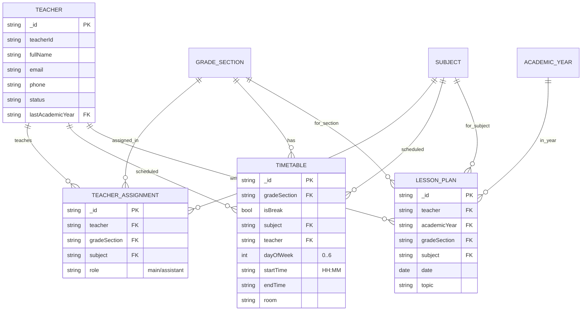

## 4) ERD – Exams & Scores (Results/Transcript)

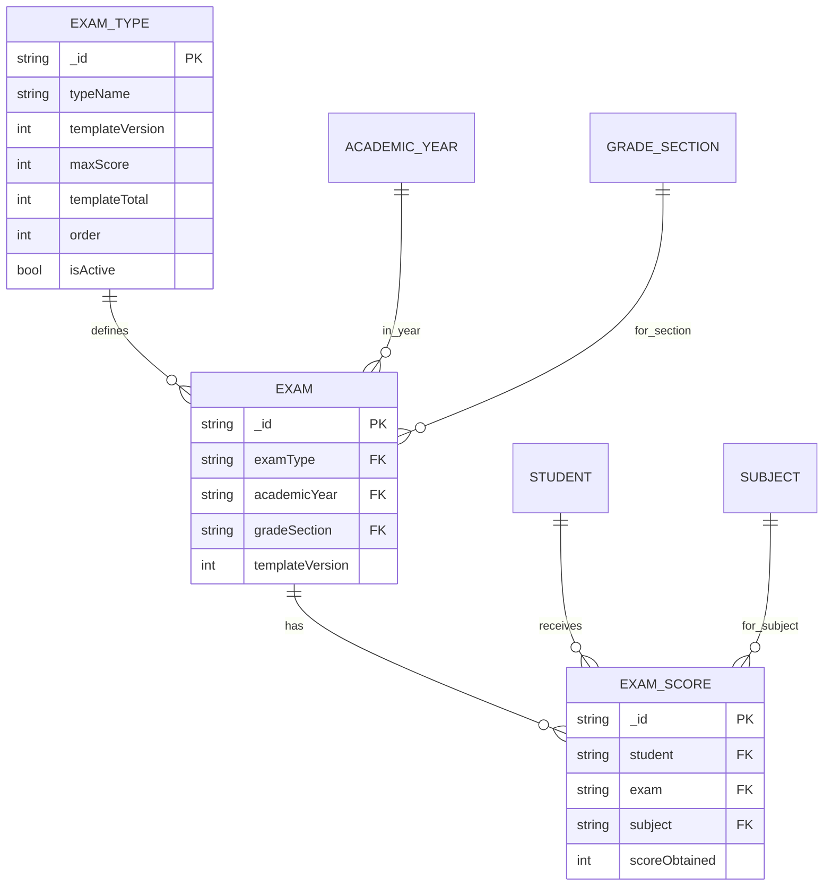

## 5) ERD – Attendance + Audit

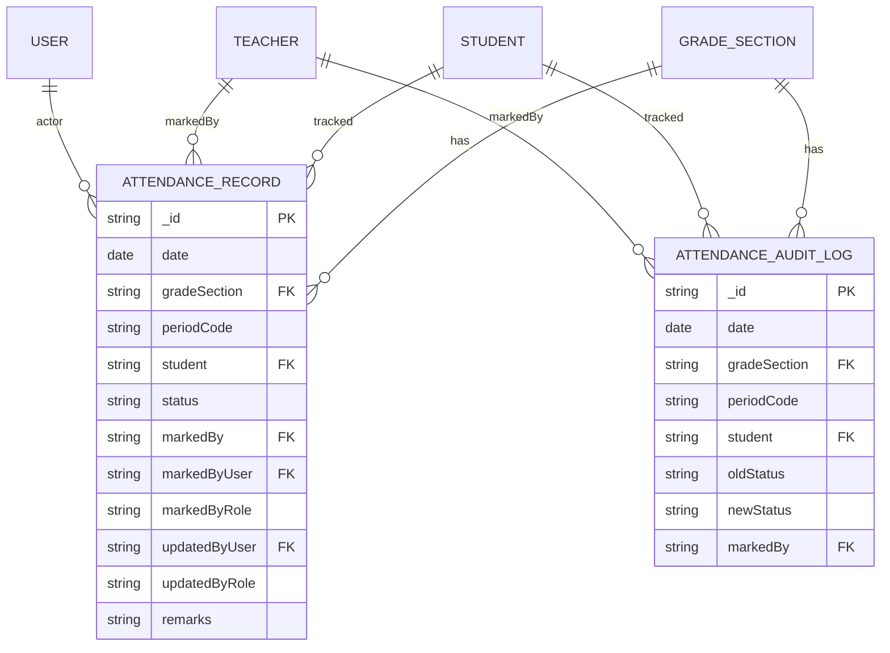

## 6) ERD – Auth/Security + Audit Logs

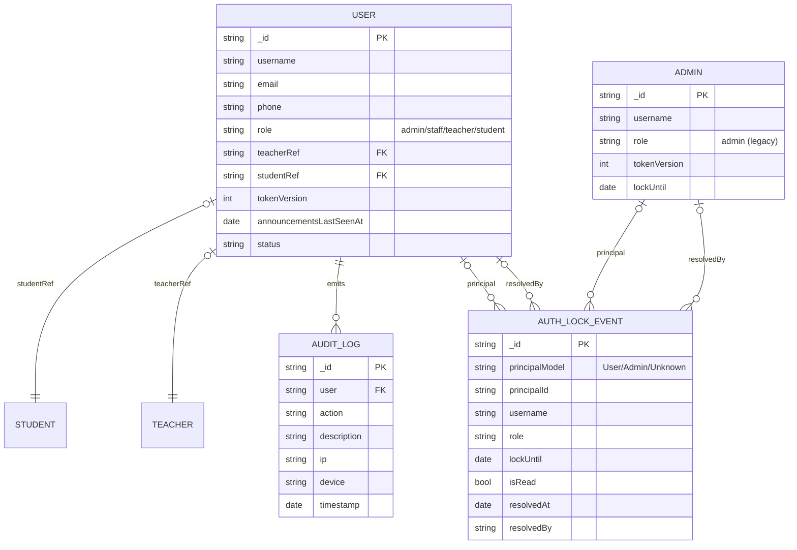

## 7) ERD – Announcements (Scoped + Unread)

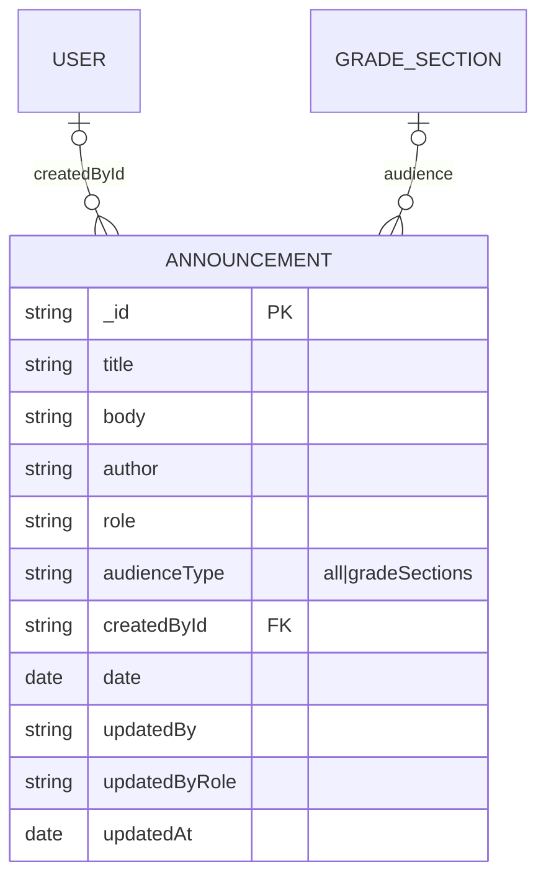

## 8) Sequence – Transfer/Reassign Enrollment

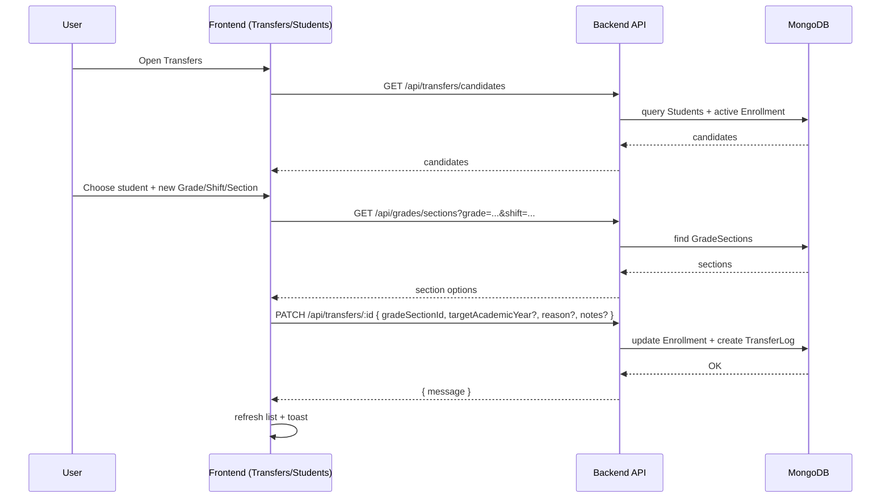

## 9) Sequence – Students Filtering (Lookups + Roster)

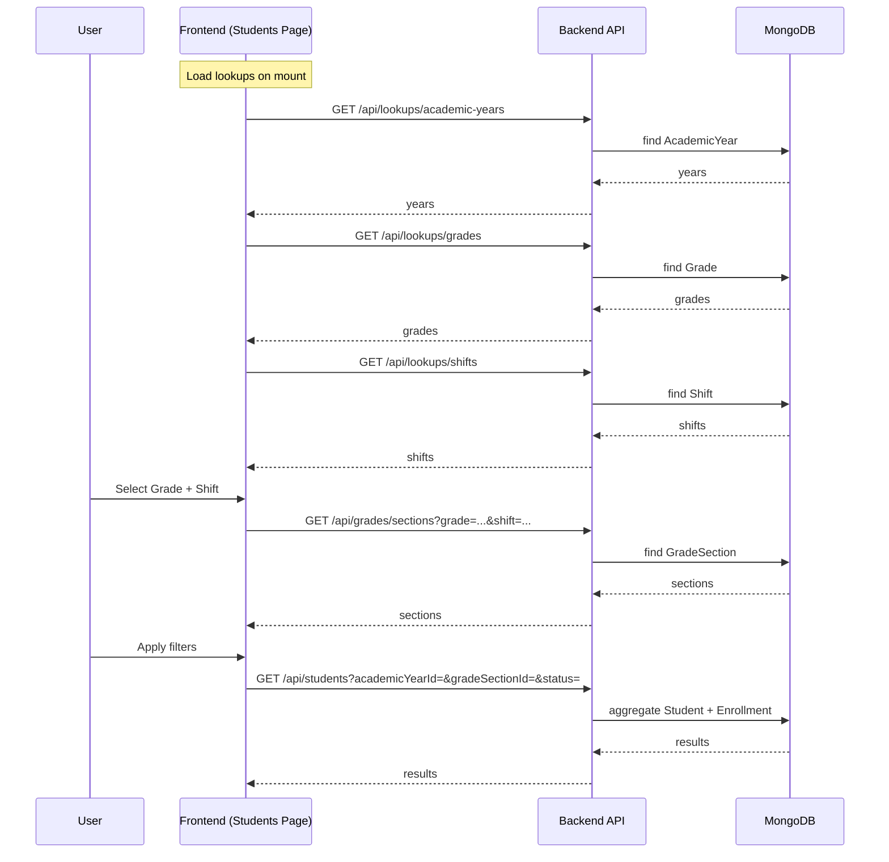

## 10) Sequence – Exam Grid, Scoring, Summary

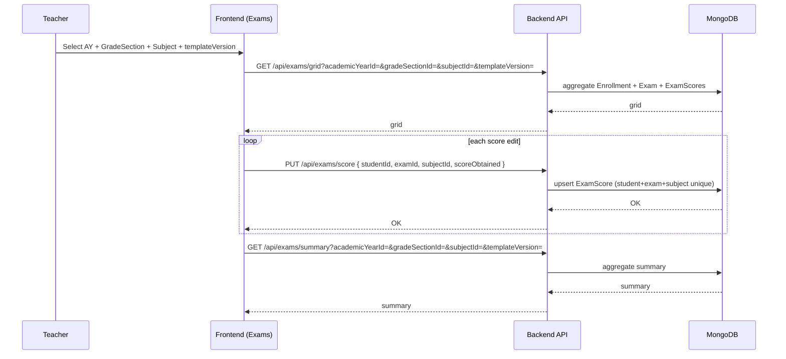

## 11) Sequence – Transcript Generation

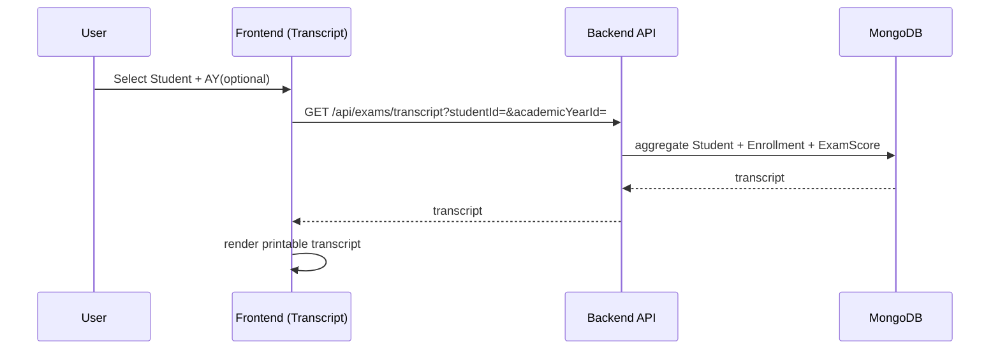

## 12) Sequence – Announcements (Realtime + Unread)

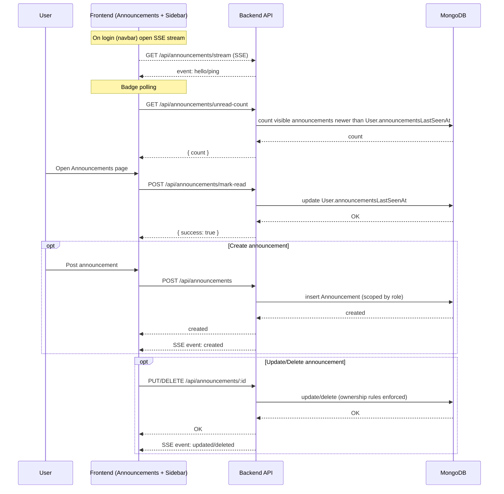

## 13) ERD – Library (Resources + Audience)

```mermaid
erDiagram
  USER o|--o{ LIBRARY_RESOURCE : createdBy
  GRADE o|--o{ LIBRARY_RESOURCE : grade_scope
  SUBJECT o|--o{ LIBRARY_RESOURCE : subject_scope

  LIBRARY_RESOURCE {
    string _id PK
    string title
    string description
    string category
    string audience "public|level"
    string grade FK
    string subject FK
    string kind "pdf|link"
    string linkUrl
    string file.url
    string file.path
    string createdById FK
    date createdAt
  }
```

## 14) ERD – Finance (Invoices/Transactions/Expenses/Payroll)

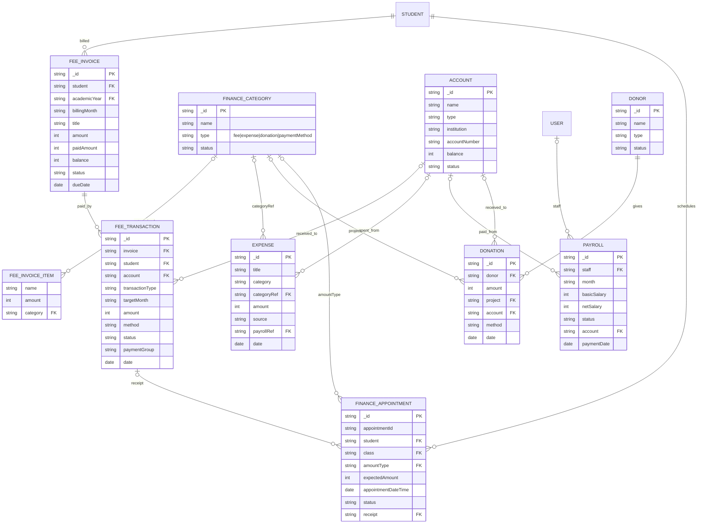

## 15) ERD – AI + Security Settings

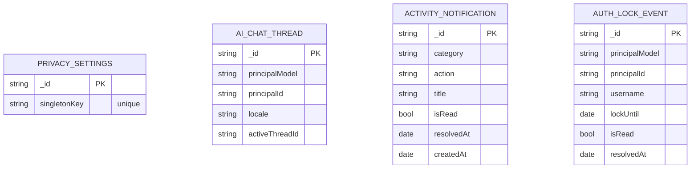
