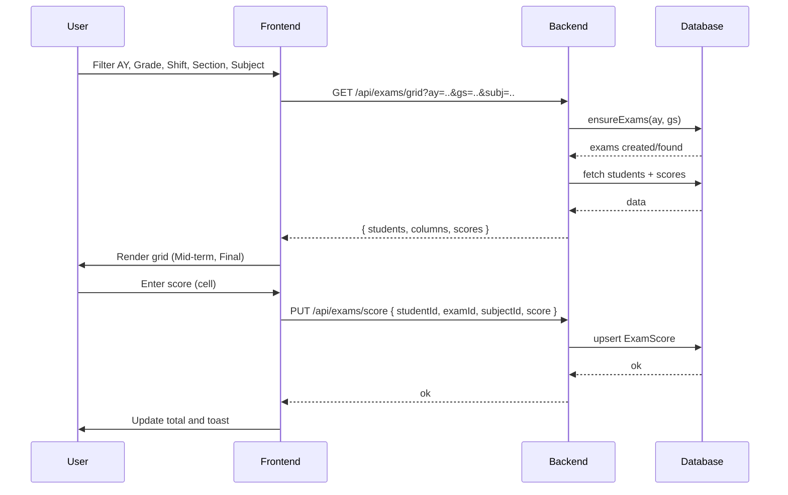

# Imtixaanada: Naqshad iyo Socod (Exam Management)

Dukumiintigaan wuxuu qeexayaa qaab-dhismeedka xogta, APIs, iyo socodka UI ee nidaamka gelinta natiijooyinka ardayda. Waxaa lagu dhisay saddex Table/Model: ExamType, Exam, ExamScore. Waxaa la jaanqaadaya qaabka hadda jira ee AcademicYear, Grade, Shift, GradeSection, Subject, Student.

## 1) Models / Tables

### 1.1 ExamType (Noocyada Imtixaanka)
| Field | Type | Sharaxaad |
|---|---|---|
| examTypeId | INT (PK) | Aqoonsiga gaarka ah |
| typeName | VARCHAR | Magaca nooca (tusaale: Mid-term, Final) |

**Cusub (Versioning / Exam Settings):**
| Field | Type | Sharaxaad |
|---|---|---|
| templateVersion | INT | Nooca qaabka (v1, v2, ...) si imtixaanadii hore u sii ahaadaan sidii ay ahaayeen |
| maxScore | INT | Max score ee component‑ka (tusaale Mid=40, Final=60) |
| order | INT | Kala horeynta columns‑ka |
| isActive | BOOL | Calaamadeyn version‑ka default ee mustaqbalka |

- Talo: Seed/lookup ah; wax laga beddelo waa naadir. Tusaale values: 1=Mid-term, 2=Final.

### 1.2 Exam (Kalfadhiga Imtixaanka)
| Field | Type | Sharaxaad |
|---|---|---|
| examId | INT (PK) | Aqoonsiga kalfadhiga |
| examTypeId | INT (FK->ExamType) | Nooca imtixaanka |
| academicYearId | INT (FK->AcademicYear) | Sanad dugsiyeedka |
| gradeSectionId | INT (FK->GradeSection) | Fasalka/Section-ka |
| templateVersion | INT | Version‑ka qaabka uu exam‑kani ku abuurmay |
| createdAt | DATETIME | Auto |
| updatedAt | DATETIME | Auto |

- Unique constraint: (examTypeId, academicYearId, gradeSectionId, templateVersion) waa inay noqdaan mid gaar ah si looga hortago nuqulo.
- Auto-generation: Markii ugu horreysa ee fasal/section loo baahan yahay imtixaan, waxaa si otomaatig ah loogu abuuraa noocyada ka jira ExamType (tusaale Mid-term, Final).

### 1.3 ExamScore (Dhibcaha Imtixaanka)
| Field | Type | Sharaxaad |
|---|---|---|
| scoreId | INT (PK) | Aqoonsiga dhibicda |
| studentId | INT (FK->Student) | Ardayga |
| examId | INT (FK->Exam) | Kalfadhiga imtixaanka |
| subjectId | INT (FK->Subject) | Maaddada |
| scoreObtained | INT | Dhibcaha uu helay |
| createdAt | DATETIME | Auto |
| updatedAt | DATETIME | Auto |

- Unique constraint: (studentId, examId, subjectId) si looga hortago saddexle nuqul ah.
- Range validation: 0 <= scoreObtained <= maxScore (maxScore-ka waxaa laga qaadan karaa config per subject ama default 100).

## 2) Socodka Shaqada (UI → API → DB)

### 2.1 Filtering iyo Auto-generation
1. User-ku wuxuu doortaa: AcademicYear → Grade → Shift → Section → Subject.
2. Frontend ayaa dira codsi: "keen grid-ka imtixaanada ee fasalkan iyo maaddadan".
3. Backend wuxuu sameeyaa:
   - Hubi in Exam-yada (Mid-term/Final) ay u jiraan (examTypeId-yada jira) ee isku darka (academicYearId, gradeSectionId). Haddii aysan jirin, auto-generate labada diiwaan Exam.
   - Soo hel ardayda section-ka (active enrollments) iyo ExamScore-yada jira ee subject-kaas.
   - Soo celi grid metadata: students[], columns = [Mid-term, Final], scores map.

### 2.2 Gelinta dhibcaha (Inline save)
- Marka user-ku galo sanduuqa score oo uu qoro qiime, frontend wuxuu diraa upsert (insert or update) codsi.
- Backend:
  - Xaqiiji: studentId wuxuu ku jiro section-kan sannadkan; subject-ka sax.
  - Hel examId-ga saxda ah (Mid-term ama Final) ee isku darka.
  - Upsert ExamScore by (studentId, examId, subjectId) → set scoreObtained.

### 2.3 Aragtida Total/Average (Frontend)
- Total/Avg waxa lagu xisaabiyaa frontend si degdeg ah (85 + 15 = 100), looma kaydiyo DB. Backend waxa uu siin karaa summary endpoint haddii loo baahdo warbixin ballaaran.

## 3) REST API Design

Prefix: /api/exams

- GET /types
  - Returns: [{ examTypeId, typeName }]
- POST /ensure
  - Body: { academicYearId, gradeSectionId }
  - Behavior: Hubi/abuur Exam diiwaannada oo dhan ee ExamType jira, soo celi [{ examId, examTypeId }]. Idempotent.
- GET /grid
  - Query: academicYearId, gradeSectionId, subjectId
  - Returns:
    {
      students: [{ studentId, fullName }],
      columns: [{ examTypeId, typeName, examId }],
      scores: [ { studentId, examId, subjectId, scoreObtained } ]
    }
  - Notes: Haddii Exam aan jirin, server-ku wuxuu sameeyaa auto-generation ka hor inta uusan soo celin (ama wuxuu ugu horreyn wacaa POST /ensure gudaha).
- PUT /score
  - Body: { studentId, examId, subjectId, scoreObtained }
  - Behavior: Upsert by (studentId, examId, subjectId)
  - Validations: 0..maxScore, student/subject/section coherence
- GET /summary
  - Query: academicYearId, gradeSectionId (ikhtiyaari subjectId)
  - Returns: totals/averages, counts, ranked list (ikhtiyaari)

Errors (examples): 400 validation, 404 not found (invalid ids), 409 conflict (unique violations—waa in idempotent upserts la adeegsadaa si looga fogaado).

## 4) Frontend: UI & Flow

- Toolbar filters: Academic Year → Grade → Shift → Section → Subject (cascading, sida Students page hore).
- Grid rendering:
  - Rows = Students
  - Columns = ExamTypes (Mid-term, Final) ee loo yaqaan by `columns[]` ee /grid.
  - Cells = editable inputs. On blur/change → call PUT /score.
  - Totals/Averages columns client-side.
- Empty state:
  - Haddii Mid-term la geliyo oo Final bannaan yahay, keliya Mid-term ayaa la kaydiyaa; Final ma jiro DB row ilaa laga qoro.
- Optimistic UI:
  - Markaad qorto 85 → isla markiiba update total, ka dibna toast success marka server ka aqbalo. Xaalad khalad → revert cell value + error toast.

## 5) Validations, Indexes, Rules

- Indexes:
  - Exam: unique(examTypeId, academicYearId, gradeSectionId, templateVersion)
  - ExamScore: unique(studentId, examId, subjectId)
- Score ranges: 0..maxScore (maxScore‑ka waxaa laga qaataa ExamType ee templateVersion‑kaas)
- Integrity:
  - studentId waa inuu ku jiraa enrollment-ka section-kan sannadkaas (active) si score loo oggolaado.
- Idempotency:
  - PUT /score waa upsert (aan samaynin nuqul). POST /ensure waa idempotent.
- RBAC (mustaqbal dhow):
  - Teacher/Staff waxay geli karaan scores ee sections ay leeyihiin; Admin dhammaan.

## 6) Edge Cases

- Student la reassign-gareeyay intii u dhexeysay Mid-term iyo Final:
  - Mid-term score wuxuu ku xirnaanayaa examId-ga section kii hore; Final score section-ka cusub. Transcript wuxuu ururin karaa labada.
- Subject aan la barin section-ka:
  - Optionally: ka hortag in subjectId aan ku jirin timetable/assignment ee section-ka.
- Bulk import/export:
  - CSV import (optional), CSV export ee grid-ka.

## 7) Pseudo-code: Auto-generation + Grid

```pseudo
function ensureExams(academicYearId, gradeSectionId):
  types = ExamType.findAll()
  for each t in types:
    upsert Exam where (examTypeId=t.id, academicYearId, gradeSectionId)
  return Exam.findAll({ academicYearId, gradeSectionId })

function getGrid(academicYearId, gradeSectionId, subjectId):
  exams = ensureExams(academicYearId, gradeSectionId)
  students = getActiveStudents(academicYearId, gradeSectionId)
  scores = ExamScore.find({ subjectId, studentId in students, examId in exams })
  columns = map exams -> { examId, examTypeId, typeName }
  return { students, columns, scores }

function upsertScore(studentId, examId, subjectId, scoreObtained):
  validateRange(scoreObtained)
  validateCoherence(studentId, examId, subjectId)
  upsert ExamScore by (studentId, examId, subjectId) set scoreObtained
```

## 8) Diagrams (Mermaid)



## 9) Qodobbo Go’aan

- ExamType values: Mid-term, Final (seed). Mustaqbal: Quiz, Assignment (optional) → waxay kordhin karaan columns si toos ah.
- Auto-generation waxaa kiciya grid request; lama abuurayo imtixaan aan la isticmaalin.
- Totals/averages client-side; warbixin ballaaran waxaa ka bixi kara /summary.
- Indexes iyo upserts si looga ilaaliyo nuqulo iyo isdaba marin.

---
Tani waa naqshad faahfaahsan oo cusub. Haddii aad ogolaato, waxaan bilaabi karnaa: 
1) Backend: Models, routes, controllers, indexes
2) Frontend: ExamManagementPage grid + inline save
3) Tijaabooyin iyo docs (USER_GUIDE qayb cusub)
